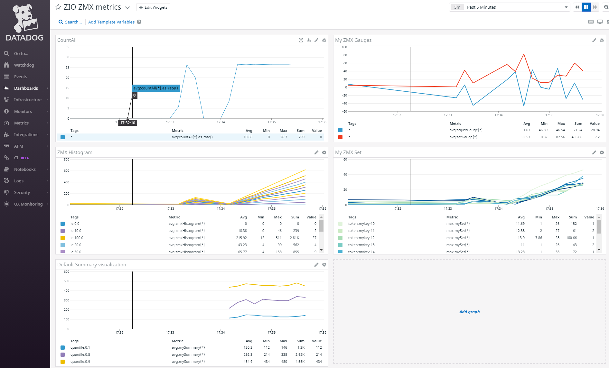

In a normal DataDog setup we will find a DataDog agent with an open UDP port where applications send their
metrics to. The format of the metrics is defined by the [DogStatsD protocol](https://docs.datadoghq.com/developers/dogstatsd/datagram_shell/?tab=metrics).

With the DataDog client zio metrics creates the relevant DogStatsD datagrams and sends them via UDP.

> The instrumented code is exactly the same as for the Prometheus instrumentation. The only difference is that
> another client is provided when the App is configured.

## ZIO metrics in DogStatsD

DogStatsD normally has its own definition how histograms and summaries are configured. In the default setup this
is defined in the config file of the statsd agent. Furthermore, a StatsD Histogram is more or less the
equivalent of a Prometheus summary.

However, whenever the desired quantiles need to change, the config must be adjusted and the agent restarted.

Therefore, the ZIO Metrics Datadog client maps the more complex metrics to a set of related gauges. This allows us to achieve
the same visualization without the need to adjust any of the agents config files.

### Counter

Counters are reported periodically within a configurable time interval.

```
countAll:1|c
```

### Gauge

Gauges are reported periodically within a configurable time interval.

```
adjustGauge:32.2787317766752|g
```

### Histogram

A histogram is reported as a datadog distribution whenever a new value is submitted. The bucket configuration is 
ignored in this case, as DataDog expects raw values to be recorded. 

```
myHistogram:3|d
```

### Summary

A summary is periodically reported as a set of related gauges, within a configurable time interval. Each quantile will 
be reported within its own gauge. The additional labels are `quantile` to address the quantile and `error` to display 
the configured error margin.

```
mySummary:123|g|#quantile:0.1,error:0.03
mySummary:254|g|#quantile:0.5,error:0.03
mySummary:441|g|#quantile:0.9,error:0.03
```

### Sets

Sets are also reported as sets of related gauges. An additional label is used to differentiate the distinct
values in the set. The name of the label is as configured in the aspect used to capture the set.

```
mySet:6|g|#token:myKey-18
mySet:1|g|#token:myKey-19
mySet:2|g|#token:myKey-13
mySet:3|g|#token:myKey-14
mySet:1|g|#token:myKey-16
mySet:3|g|#token:myKey-10
mySet:2|g|#token:myKey-11
mySet:1|g|#token:myKey-12
```

## The ZIO metrics DataDog example

```scala
import zio.Console._
import zio._
import zio.metrics.connectors._

val instrumentedSample = new InstrumentedSample() {}
```

For DataDog we do need to spin up our own server. Rather we need to provide a client that can send datagrams
to a specified UDP destination.

Again we need an effect that runs our instrumented code until the user presses any key:

```scala 
val execute =
  for {
   fiber <- instrumentedSample.program.fork
    _ <- putStrLn("Press Any Key") *> getStrLn.orDie 
    _ <- fiber.interrupt
  } yield ExitCode.success
```  

Now, we can override the `run` method of our ZIO `App` and simply provide a `datadog.datadogLayer`.

```scala 
  override def run: ZIO[ZIOAppArgs with Scope, Any, Any] =
    execute
      .provide(
        ZLayer.succeed(datadog.DatadogConfig("localhost", 8125)),
        ZLayer.succeed(MetricsConfig(100.millis)),
        datadog.datadogLayer,
      )
      .orDie
```

## A simple StatsD / Datadog setup

The following steps describe how to set up a ZIO application reporting to [Datadog](https://www.datadoghq.com/) using a free Datadog account
with limited functionality. The local setup is Windows 10 with WSL and Docker installed running Ubuntu 18.04 within WSL.

In principle the setup is as follows:

1. The ZIO application sends datagrams to `localhost:8125` via UDP, so we need a component picking up those datagrams.
1. Run a Datadog Collector within a docker image exposing a Unix socket for datagrams.
1. Run `socat` to listen on the UDP socket 8125 and forward incoming traffic to the Unix socket.
1. Configure a dashboard in Datadog to visualize the metrics.

### Get and run the docker based Datadog collector

Upon registration with datadoghq.com you will get an API key which is required to configure the agents collecting data. If you are planning
to experiment with different agents, take a note of your API key for further reference. In the steps below the API key will be referred to
as `$APIKEY`


For our example we have chosen to use the docker based collector and use a unix socket to report our datagrams to that agent.

You can start the agent from the command line with

```
docker run --name dd-agent -e DD_API_KEY=$APIKEY -e DD_SITE=datadoghq.eu \
  -e DD_DOGSTATSD_SOCKET=/var/run/datadog/datadog.sock \
  -v /var/run/datadog:/var/run/datadog \
  -v /var/run/docker.sock:/var/run/docker.sock:ro \
  datadog/agent
```

As you can see, we require that the directory `/var/run/datadog` exists so that we can use it as a volume within the agent's docker container. The environment variable `DD_DOGSTATSD_SOCKET` tells the agent to use a unix socket to listen for datagrams. The socket file must reside within the mounted volume.

This will start the datadog collector within docker and we have a unix socket to report our datagrams to.

The next step is to create a UDP socket where our application can report its datagrams to. For our example we have chosen `socat` to forward
UDP traffic to our unix socket:

```
sudo socat -s -u udp-recv:8125 unix-sendto:/var/run/datadog/datadog.sock
```

> You could add the `-v` parameter to the socat call to run socat in verbose mode. That would print
> all traffic being forwarded to the console as well. This is useful to determine whether
> datagrams are actually sent.

### Run the Datadog example

Now, the Datadog example can be started from within the project checkout directory with

```
sbt sampleApp/run
```

### Visualize the metrics

1. Log in to your datadog account
1. From the menu on left hand side select `Dashboards/New Dashboard'
1. In the upper right corner, click on the dashboard settings and select 'Import Dashboard JSON'
1. From the filesystem, select `$DIR/examples/statsd/ZIOMetrics.json`
1. Confirm to override the dashboard configuration
1. Save the just imported dashboard
1. From the dashboard list select _ZIO metrics_
1. The Datadog dashboard is displayed

### Datadog dashboard



